# Polyglot Codebase Knowledge Graph

> Generated offline by **readmenator**. Supports C, C++, Python, Go, Rust, JS/TS, Java, C#, Shell, PHP, Dart, GDScript, Nim, ASM, Ruby, Swift, Kotlin, Scala, Lua, Elixir.
> No LLMs. No tokens. Pure static analysis. See more [here](https://github.com/grisuno/ReadMenator)

**Total Files Parsed:** 6 | **Total Symbols Extracted:** 7 | **Total Imports:** 22

<!-- ranking_model: v1.0 | weights: {ppr:0.45,auth:0.2,test:0.15,doc:0.1,fresh:0.1} | alpha:0.85 | commit:f0ae16d | date:2026-07-18 -->


## Table of Contents

1. [Statistics Dashboard](#statistics-dashboard)
2. [Architectural Layers](#architectural-layers)
3. [Ranked Context](#ranked-context)
4. [God Nodes](#god-nodes)
5. [Suggested Questions](#suggested-questions)
6. [Hotspot Analysis](#hotspot-analysis)
7. [Change Impact Analysis](#change-impact-analysis)
8. [Suggested Linting Rules](#suggested-linting-rules)
9. [Orphans](#orphans)
10. [Query Recipes](#query-recipes)
11. [Structural Knowledge Map](#structural-knowledge-map)
12. [UML Class Diagram](#uml-class-diagram)
13. [Code Property Graph](#code-property-graph)
14. [Architecture Reference](#architecture-reference)
    - [PY (6 files)](#py-6-files)

---

## Statistics Dashboard

| Metric | Value |
|--------|-------|
| Total Files | 6 |
| Total Symbols | 7 |
| Total Imports | 22 |
| Call Edges | 29 |
| Inheritance Edges | 0 |
| Languages | 1 |
| Avg Symbols/File | 1.2 |
| Avg Imports/File | 3.7 |

### Top Files by Import Count (Fan-Out)

| File | Imports | Symbols | Language |
|------|---------|---------|----------|
| `GLMandelbrot.py` | 6 | 1 | py |
| `hypermandala.py` | 5 | 0 | py |
| `circle.py` | 3 | 1 | py |
| `hypercircle.py` | 3 | 2 | py |
| `main.py` | 3 | 1 | py |
| `mandelbrot.py` | 2 | 2 | py |

---

## Architectural Layers

Auto-detected from path patterns, naming conventions, and imported frameworks.

| Layer | Files |
|-------|-------|
| utility | 5 |
| data_access | 1 |

### utility

- `GLMandelbrot.py` (py, 1 symbols)
- `circle.py` (py, 1 symbols)
- `hypercircle.py` (py, 2 symbols)
- `main.py` (py, 1 symbols)
- `mandelbrot.py` (py, 2 symbols)

### data_access

- `hypermandala.py` (py, 0 symbols)

---

## Ranked Context

Files ranked by composite score for the current query context. The ranking combines Personalized PageRank (query relevance), global authority, test coverage, documentation coverage, and code freshness. Model: v1.0.

| Rank | File | Composite | PPR | Authority | Test | Doc |
|------|------|-----------|-----|-----------|------|-----|
| 1 | `GLMandelbrot.py` | 0.0000 | 0.0000 | 0.0000 | 0.00 | 0.00 |
| 2 | `circle.py` | 0.0000 | 0.0000 | 0.0000 | 0.00 | 0.00 |
| 3 | `hypercircle.py` | 0.0000 | 0.0000 | 0.0000 | 0.00 | 0.00 |
| 4 | `hypermandala.py` | 0.0000 | 0.0000 | 0.0000 | 0.00 | 0.00 |
| 5 | `main.py` | 0.0000 | 0.0000 | 0.0000 | 0.00 | 0.00 |
| 6 | `mandelbrot.py` | 0.0000 | 0.0000 | 0.0000 | 0.00 | 0.00 |

---

## God Nodes

Most architecturally central files ranked by combined import/export degree and symbol richness.

| File | Score | Connections | PageRank |
|------|-------|-------------|----------|
| `hypercircle.py` | 0.2 | | 0.0000 |
| `mandelbrot.py` | 0.2 | | 0.0000 |
| `GLMandelbrot.py` | 0.1 | | 0.0000 |
| `circle.py` | 0.1 | | 0.0000 |
| `main.py` | 0.1 | | 0.0000 |
| `hypermandala.py` | 0.0 | | 0.0000 |

---

## Suggested Questions

Auto-generated exploration prompts based on graph structure:

- What does hypercircle.py depend on, and what depends on it? (0 connections)
- What does mandelbrot.py depend on, and what depends on it? (0 connections)
- What does GLMandelbrot.py depend on, and what depends on it? (0 connections)
- What is the overall architecture of this codebase?

---

## Hotspot Analysis

Files ranked by combined complexity (symbol count) and centrality (connection count). High-scoring files are architecturally critical and may need refactoring attention.

| File | Complexity | Centrality | Combined | Symbols | Connections |
|------|-----------|------------|----------|---------|-------------|
| `GLMandelbrot.py` | 0.500 | 1.000 | 0.800 | 1 | 6 |
| `circle.py` | 0.500 | 0.500 | 0.500 | 1 | 3 |
| `hypercircle.py` | 1.000 | 0.500 | 0.700 | 2 | 3 |
| `hypermandala.py` | 0.000 | 0.833 | 0.500 | 0 | 5 |
| `main.py` | 0.500 | 0.500 | 0.500 | 1 | 3 |
| `mandelbrot.py` | 1.000 | 0.333 | 0.600 | 2 | 2 |

---

## Change Impact Analysis

Files sorted by how many other files would be affected if they changed. High-impact files should be changed with caution.

| File | Direct Dependents | Transitive Dependents | Total Impact |
|------|------------------|----------------------|--------------|
| `GLMandelbrot.py` | 0 | 0 | 0 |
| `circle.py` | 0 | 0 | 0 |
| `hypercircle.py` | 0 | 0 | 0 |
| `hypermandala.py` | 0 | 0 | 0 |
| `main.py` | 0 | 0 | 0 |
| `mandelbrot.py` | 0 | 0 | 0 |

---

## Suggested Linting Rules

Automatically suggested linting and security rules based on patterns detected in the codebase. These can be exported as Semgrep rules using the `--export-rules` flag.

| Rule ID | Severity | Description | Language | Matches |
|---------|----------|-------------|----------|---------|
| `RM001` | info | Large number of functions in py: 7 total | py | 7 |

---

## Orphans

Files with no documentation or low connectivity. These are candidates for documentation investment or cleanup.

- `GLMandelbrot.py` (1 symbols, no doc)
- `circle.py` (1 symbols, no doc)
- `hypercircle.py` (2 symbols, no doc)
- `hypermandala.py` (0 symbols, no doc)
- `main.py` (1 symbols, no doc)
- `mandelbrot.py` (2 symbols, no doc)

---

## Query Recipes

Example queries you can run against this knowledge base using the ranking engine:

```
# Find files most relevant to a concept
readmenator query "Where is the import resolver implemented?"

# Rank files by relevance to a topic
readmenator query "How does documentation generation work?"

# Explain why a file ranks highly
readmenator query "explain readmenator/_documentation.py"

# Trace dependency paths with ranked context
readmenator query "path from CLI to exporter"
```

The ranking model uses the following signals:

- **Personalized PageRank** (45% weight): query-specific relevance via seed propagation
- **Global Authority** (20% weight): structural importance via standard PageRank
- **Test Coverage** (15% weight): fraction of symbols referenced in test files
- **Doc Coverage** (10% weight): presence of docstrings and file-level docs
- **Freshness** (10% weight): recent modification activity

Results include score decomposition and justification paths for each ranked item.

---

## Structural Knowledge Map

```mermaid
graph TD
    classDef mod fill:#1e1e1e,stroke:#ff6666,stroke-width:2px,color:#fff;
    classDef cls fill:#2d2d2d,stroke:#4ec9b0,stroke-width:2px,color:#fff;
    classDef fn fill:#333,stroke:#dcdcaa,stroke-width:1px,color:#dcdcaa;
    classDef ext fill:#111,stroke:#666,stroke-dasharray:5 5,color:#aaa;
    GLMandelbrot_py["GLMandelbrot.py (py)"]
    class GLMandelbrot_py mod;
    GLMandelbrot_py_calculate_and_draw_mandelbrot["calculate_and_draw_mandelbrot"]
    class GLMandelbrot_py_calculate_and_draw_mandelbrot fn;
    GLMandelbrot_py --> GLMandelbrot_py_calculate_and_draw_mandelbrot
    hypermandala_py["hypermandala.py (py)"]
    class hypermandala_py mod;
    hypercircle_py["hypercircle.py (py)"]
    class hypercircle_py mod;
    hypercircle_py_generate_valid_params["generate_valid_params"]
    class hypercircle_py_generate_valid_params fn;
    hypercircle_py --> hypercircle_py_generate_valid_params
    hypercircle_py_draw_hypergeometric_shape["draw_hypergeometric_shape"]
    class hypercircle_py_draw_hypergeometric_shape fn;
    hypercircle_py --> hypercircle_py_draw_hypergeometric_shape
    circle_py["circle.py (py)"]
    class circle_py mod;
    circle_py_generate_valid_params["generate_valid_params"]
    class circle_py_generate_valid_params fn;
    circle_py --> circle_py_generate_valid_params
    main_py["main.py (py)"]
    class main_py mod;
    main_py_hypergeom["hypergeom"]
    class main_py_hypergeom fn;
    main_py --> main_py_hypergeom
    mandelbrot_py["mandelbrot.py (py)"]
    class mandelbrot_py mod;
    ext_pygame["pygame"]
    class ext_pygame ext;
    GLMandelbrot_py -.->|imports| ext_pygame
    ext_pygame_locals["pygame.locals"]
    class ext_pygame_locals ext;
    GLMandelbrot_py -.->|imports| ext_pygame_locals
    ext_OpenGL_GL["OpenGL.GL"]
    class ext_OpenGL_GL ext;
    GLMandelbrot_py -.->|imports| ext_OpenGL_GL
    ext_numpy["numpy"]
    class ext_numpy ext;
    GLMandelbrot_py -.->|imports| ext_numpy
    ext_sys["sys"]
    class ext_sys ext;
    GLMandelbrot_py -.->|imports| ext_sys
    ext_joblib["joblib"]
    class ext_joblib ext;
    GLMandelbrot_py -.->|imports| ext_joblib
    circle_py -.->|imports| ext_pygame
    circle_py -.->|imports| ext_numpy
    ext_math["math"]
    class ext_math ext;
    circle_py -.->|imports| ext_math
    hypercircle_py -.->|imports| ext_pygame
    hypercircle_py -.->|imports| ext_numpy
    hypercircle_py -.->|imports| ext_math
    ext_tensorflow["tensorflow"]
    class ext_tensorflow ext;
    hypermandala_py -.->|imports| ext_tensorflow
    hypermandala_py -.->|imports| ext_tensorflow
    hypermandala_py -.->|imports| ext_numpy
    ext_matplotlib_pyplot["matplotlib.pyplot"]
    class ext_matplotlib_pyplot ext;
    hypermandala_py -.->|imports| ext_matplotlib_pyplot
    ext_os["os"]
    class ext_os ext;
    hypermandala_py -.->|imports| ext_os
    main_py -.->|imports| ext_matplotlib_pyplot
    main_py -.->|imports| ext_numpy
    ext_scipy_special["scipy.special"]
    class ext_scipy_special ext;
    main_py -.->|imports| ext_scipy_special
    mandelbrot_py -.->|imports| ext_pygame
    mandelbrot_py -.->|imports| ext_math
```



---

## Code Property Graph

Machine-readable Code Property Graph (CPG) in JSON-LD format. This block allows AI agents to parse the full structural graph without additional file reads. Compatible with GraphRAG pipelines.

```json
{"@context": "https://schema.org", "analysis": {"communities": [], "god_nodes": [{"node_id": "hypercircle.py", "score": 0.2}, {"node_id": "mandelbrot.py", "score": 0.2}, {"node_id": "GLMandelbrot.py", "score": 0.1}, {"node_id": "circle.py", "score": 0.1}, {"node_id": "main.py", "score": 0.1}, {"node_id": "hypermandala.py", "score": 0.0}], "surprising_connections": []}, "edges": [{"confidence": "EXTRACTED", "relation": "imports", "source": "GLMandelbrot.py", "target": "pygame"}, {"confidence": "EXTRACTED", "relation": "imports", "source": "GLMandelbrot.py", "target": "pygame.locals"}, {"confidence": "EXTRACTED", "relation": "imports", "source": "GLMandelbrot.py", "target": "OpenGL.GL"}, {"confidence": "EXTRACTED", "relation": "imports", "source": "GLMandelbrot.py", "target": "numpy"}, {"confidence": "EXTRACTED", "relation": "imports", "source": "GLMandelbrot.py", "target": "sys"}, {"confidence": "EXTRACTED", "relation": "imports", "source": "GLMandelbrot.py", "target": "joblib"}, {"confidence": "EXTRACTED", "relation": "imports", "source": "circle.py", "target": "pygame"}, {"confidence": "EXTRACTED", "relation": "imports", "source": "circle.py", "target": "numpy"}, {"confidence": "EXTRACTED", "relation": "imports", "source": "circle.py", "target": "math"}, {"confidence": "EXTRACTED", "relation": "imports", "source": "hypercircle.py", "target": "pygame"}, {"confidence": "EXTRACTED", "relation": "imports", "source": "hypercircle.py", "target": "numpy"}, {"confidence": "EXTRACTED", "relation": "imports", "source": "hypercircle.py", "target": "math"}, {"confidence": "EXTRACTED", "relation": "imports", "source": "hypermandala.py", "target": "tensorflow"}, {"confidence": "EXTRACTED", "relation": "imports", "source": "hypermandala.py", "target": "tensorflow"}, {"confidence": "EXTRACTED", "relation": "imports", "source": "hypermandala.py", "target": "numpy"}, {"confidence": "EXTRACTED", "relation": "imports", "source": "hypermandala.py", "target": "matplotlib.pyplot"}, {"confidence": "EXTRACTED", "relation": "imports", "source": "hypermandala.py", "target": "os"}, {"confidence": "EXTRACTED", "relation": "imports", "source": "main.py", "target": "matplotlib.pyplot"}, {"confidence": "EXTRACTED", "relation": "imports", "source": "main.py", "target": "numpy"}, {"confidence": "EXTRACTED", "relation": "imports", "source": "main.py", "target": "scipy.special"}, {"confidence": "EXTRACTED", "relation": "imports", "source": "mandelbrot.py", "target": "pygame"}, {"confidence": "EXTRACTED", "relation": "imports", "source": "mandelbrot.py", "target": "math"}], "generator": "readmenator", "metadata": {"edge_count": 51, "file_count": 6, "language_count": 1, "symbol_count": 7}, "nodes": [{"id": "GLMandelbrot.py", "kind": "module", "label": "GLMandelbrot.py", "language": "py", "sha256": "066a6ec5f2de58c8", "symbol_count": 1, "symbols": [{"kind": "function", "line": 25, "name": "calculate_and_draw_mandelbrot", "signature": "def calculate_and_draw_mandelbrot()"}]}, {"id": "circle.py", "kind": "module", "label": "circle.py", "language": "py", "sha256": "934d36207147c367", "symbol_count": 1, "symbols": [{"kind": "function", "line": 12, "name": "generate_valid_params", "signature": "def generate_valid_params()"}]}, {"id": "hypercircle.py", "kind": "module", "label": "hypercircle.py", "language": "py", "sha256": "8a8c7cce3d9d19c8", "symbol_count": 2, "symbols": [{"kind": "function", "line": 12, "name": "generate_valid_params", "signature": "def generate_valid_params()"}, {"kind": "function", "line": 20, "name": "draw_hypergeometric_shape", "signature": "def draw_hypergeometric_shape(a, b, z, angle, num_points)"}]}, {"id": "hypermandala.py", "kind": "module", "label": "hypermandala.py", "language": "py", "sha256": "dfce8398ec934a54", "symbol_count": 0, "symbols": []}, {"id": "main.py", "kind": "module", "label": "main.py", "language": "py", "sha256": "b9057ca541a2be75", "symbol_count": 1, "symbols": [{"kind": "function", "line": 6, "name": "hypergeom", "signature": "def hypergeom(a, b, c, z)"}]}, {"id": "mandelbrot.py", "kind": "module", "label": "mandelbrot.py", "language": "py", "sha256": "e00f03e969f08886", "symbol_count": 2, "symbols": [{"kind": "function", "line": 13, "name": "map_value", "signature": "def map_value(value, from_low, from_high, to_low, to_high)"}, {"kind": "function", "line": 17, "name": "mandelbrot", "signature": "def mandelbrot(c)"}]}], "type": "CodePropertyGraph", "version": "1.0"}
```

---

## Architecture Reference

### PY (6 files)

#### `GLMandelbrot.py`
**Path:** `GLMandelbrot.py`

**Functions:**
- `calculate_and_draw_mandelbrot` (line 25) `def calculate_and_draw_mandelbrot()`

#### `circle.py`
**Path:** `circle.py`

**Functions:**
- `generate_valid_params` (line 12) `def generate_valid_params()`

#### `hypercircle.py`
**Path:** `hypercircle.py`

**Functions:**
- `generate_valid_params` (line 12) `def generate_valid_params()`
- `draw_hypergeometric_shape` (line 20) `def draw_hypergeometric_shape(a, b, z, angle, num_points)`

#### `hypermandala.py`
**Path:** `hypermandala.py`

*No symbols extracted*

#### `main.py`
**Path:** `main.py`

**Functions:**
- `hypergeom` (line 6) `def hypergeom(a, b, c, z)`

#### `mandelbrot.py`
**Path:** `mandelbrot.py`

**Functions:**
- `map_value` (line 13) `def map_value(value, from_low, from_high, to_low, to_high)`
- `mandelbrot` (line 17) `def mandelbrot(c)`
