# Polyglot Codebase Knowledge Graph

> Generated offline by **readmenator**. Supports C, C++, Python, Go, Rust, JS/TS, Java, C#, Shell, PHP, Dart, GDScript, Nim, ASM.
> No LLMs. No tokens. Pure static analysis.

**Total Files Parsed:** 6 | **Total Symbols Extracted:** 7 | **Total Imports:** 22

## Structural Knowledge Map

```mermaid
graph TD
    classDef mod fill:#1e1e1e,stroke:#ff6666,stroke-width:2px,color:#fff;
    classDef cls fill:#2d2d2d,stroke:#4ec9b0,stroke-width:2px,color:#fff;
    classDef fn fill:#333,stroke:#dcdcaa,stroke-width:1px,color:#dcdcaa;
    classDef ext fill:#111,stroke:#666,stroke-dasharray: 5 5,color:#aaa;
    GLMandelbrot_py["GLMandelbrot.py (py)"]
    class GLMandelbrot_py mod;
    GLMandelbrot_py_calculate_and_draw_mandelbrot["calculate_and_draw_mandelbrot"]
    class GLMandelbrot_py_calculate_and_draw_mandelbrot fn;
    GLMandelbrot_py --> GLMandelbrot_py_calculate_and_draw_mandelbrot
    hypermandala_py["hypermandala.py (py)"]
    class hypermandala_py mod;
    hypercircle_py["hypercircle.py (py)"]
    class hypercircle_py mod;
    hypercircle_py_generate_valid_params["generate_valid_params"]
    class hypercircle_py_generate_valid_params fn;
    hypercircle_py --> hypercircle_py_generate_valid_params
    hypercircle_py_draw_hypergeometric_shape["draw_hypergeometric_shape"]
    class hypercircle_py_draw_hypergeometric_shape fn;
    hypercircle_py --> hypercircle_py_draw_hypergeometric_shape
    circle_py["circle.py (py)"]
    class circle_py mod;
    circle_py_generate_valid_params["generate_valid_params"]
    class circle_py_generate_valid_params fn;
    circle_py --> circle_py_generate_valid_params
    main_py["main.py (py)"]
    class main_py mod;
    main_py_hypergeom["hypergeom"]
    class main_py_hypergeom fn;
    main_py --> main_py_hypergeom
    mandelbrot_py["mandelbrot.py (py)"]
    class mandelbrot_py mod;
    mandelbrot_py_map_value["map_value"]
    class mandelbrot_py_map_value fn;
    mandelbrot_py --> mandelbrot_py_map_value
    mandelbrot_py_mandelbrot["mandelbrot"]
    class mandelbrot_py_mandelbrot fn;
    mandelbrot_py --> mandelbrot_py_mandelbrot
    ext_pygame["pygame"]
    class ext_pygame ext;
    GLMandelbrot_py -.->|imports| ext_pygame
    ext_pygame_locals["pygame.locals"]
    class ext_pygame_locals ext;
    GLMandelbrot_py -.->|imports| ext_pygame_locals
    ext_OpenGL_GL["OpenGL.GL"]
    class ext_OpenGL_GL ext;
    GLMandelbrot_py -.->|imports| ext_OpenGL_GL
    ext_numpy["numpy"]
    class ext_numpy ext;
    GLMandelbrot_py -.->|imports| ext_numpy
    ext_sys["sys"]
    class ext_sys ext;
    GLMandelbrot_py -.->|imports| ext_sys
    ext_joblib["joblib"]
    class ext_joblib ext;
    GLMandelbrot_py -.->|imports| ext_joblib
    circle_py -.->|imports| ext_pygame
    circle_py -.->|imports| ext_numpy
    ext_math["math"]
    class ext_math ext;
    circle_py -.->|imports| ext_math
    hypercircle_py -.->|imports| ext_pygame
    hypercircle_py -.->|imports| ext_numpy
    hypercircle_py -.->|imports| ext_math
    ext_tensorflow["tensorflow"]
    class ext_tensorflow ext;
    hypermandala_py -.->|imports| ext_tensorflow
    hypermandala_py -.->|imports| ext_tensorflow
    hypermandala_py -.->|imports| ext_numpy
    ext_matplotlib_pyplot["matplotlib.pyplot"]
    class ext_matplotlib_pyplot ext;
    hypermandala_py -.->|imports| ext_matplotlib_pyplot
    ext_os["os"]
    class ext_os ext;
    hypermandala_py -.->|imports| ext_os
    main_py -.->|imports| ext_matplotlib_pyplot
    main_py -.->|imports| ext_numpy
    ext_scipy_special["scipy.special"]
    class ext_scipy_special ext;
    main_py -.->|imports| ext_scipy_special
    mandelbrot_py -.->|imports| ext_pygame
    mandelbrot_py -.->|imports| ext_math
```

---

## Architecture Reference

### PY (6 files)

#### `GLMandelbrot.py`
**Path:** `GLMandelbrot.py`

**Functions:**
- `calculate_and_draw_mandelbrot` (line 25)

#### `circle.py`
**Path:** `circle.py`

**Functions:**
- `generate_valid_params` (line 12)

#### `hypercircle.py`
**Path:** `hypercircle.py`

**Functions:**
- `generate_valid_params` (line 12)
- `draw_hypergeometric_shape` (line 20)

#### `hypermandala.py`
**Path:** `hypermandala.py`

*No symbols extracted*

#### `main.py`
**Path:** `main.py`

**Functions:**
- `hypergeom` (line 6)

#### `mandelbrot.py`
**Path:** `mandelbrot.py`

**Functions:**
- `map_value` (line 13)
- `mandelbrot` (line 17)
